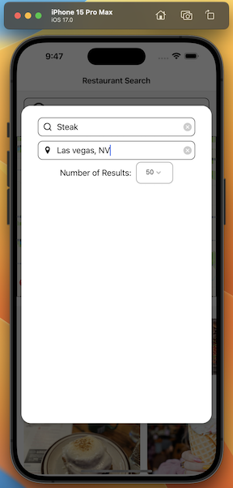
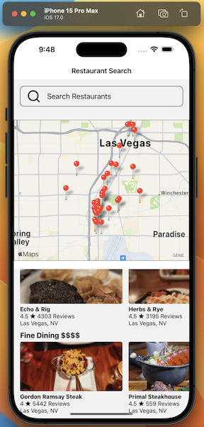

# React Native Restaurant Search App

This application is an enhancement of the original project taught in the React Native course by Stephen Grider on Udemy. While the core concepts come from the course, several new features and optimizations have been added to improve functionality and user experience.

## Features Added:
1. **Typescript Integration** - The app has been refactored and is now fully typed, enhancing maintainability and developer experience.
2. **Modal with Advanced Search**:
   - Search by cuisine type.
   - Filter by location.
   - Specify the number of results desired.
3. **Map Display of Results** - View search results in an interactive map, offering a visual representation of restaurant locations.
4. **SWR** - Implemented SWR (Stale-While-Revalidate) for efficient data fetching and caching.
5. **AsyncStorage Reload** - Data persistence even after app reloads, ensuring the user's data is consistently available.

## Getting Started:

### Prerequisites:
- Ensure you have `Node.js` and `yarn` installed on your machine.
- Install `expo-cli` globally using yarn: `yarn global add expo-cli`.
- Install `Xcode` for an iPhone IOS simulator or download the `Expo Go` app on your mobile device. Note: this app was designed for the Apple iPhone IOS.

### Installation:
1. Clone the repository: `git clone https://github.com/dwmson/rn-restaurant-app.git`.
2. Navigate to the project directory: `cd rn-restaurant-app`.
3. Install dependencies: `yarn install` or simply `yarn`.
4. Add your Yelp API key to the `./src/api/yelp.js` file.
5. Run the app: `expo start`.

## Acknowledgments:
- Huge thanks to [Stephen Grider](https://www.udemy.com/user/sgslo/) for his informative React Native course on Udemy which served as a foundation for this project.

## Note for Visitors

This project is primarily intended for demonstration purposes to showcase skills. While you're welcome to view and learn from the code, please be aware that it's not intended for reuse or distribution. Kindly contact the repository owner for any further inquiries or permissions.

## Screenshots

<table>
  <tr>
    <td></td>
    <td></td>
    <td></td>
    <td></td>
    <td></td>
  </tr>
</table>

🚫 **Disclaimer:** The restaurants depicted in the app screenshots and any related content are not affiliated with, endorsed by, sponsored by, or in any way associated with this project or its creator. The images and content are sourced from the Yelp API and are utilized purely for demonstration purposes in this project.
